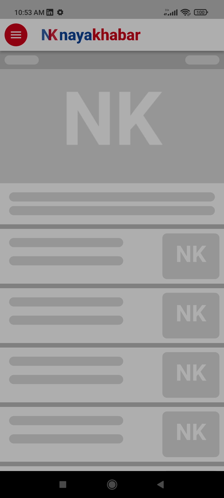
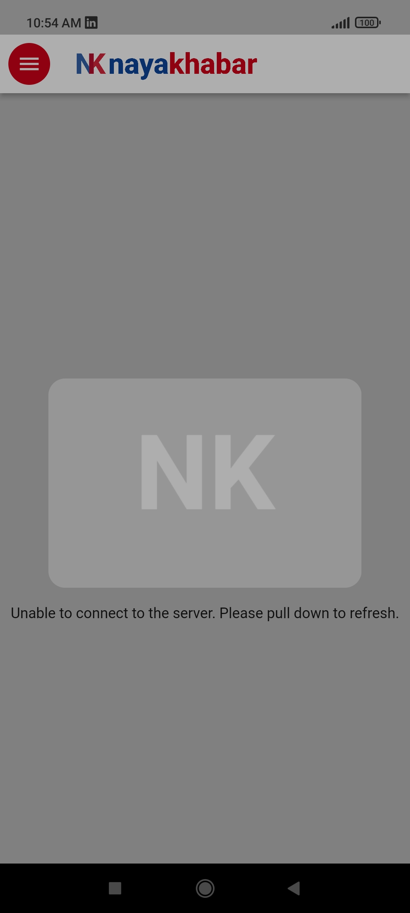

# news_app

A Flutter news app demo for New IT Venture Company.


## Screenshots
___






## 1. Getting Started
___

This project is a simple application for fetching and showing the current news from [NewsAPI](https://newsapi.org/). It uses the developer api provided by NewsAPI team for fetching the most recent news and show them to the user.

For the sake of simplicity, we are going to clone the [Online Khabar](https://play.google.com/store/apps/details?id=com.shirantech.onlinekhabar&hl=ne&gl=US) mobile application for design.

## 2. Project Preliminary Choices
___
There are multiple ways of doing the project in terms of state management, state persistence, navigation and so on. Due to limited time constraints, following choices are made:

1. Design for the app is cloned from [Online Khabar](https://play.google.com/store/apps/details?id=com.shirantech.onlinekhabar&hl=ne&gl=US) mobile application.
2. State management is done using BLoC.
3. HTTP client is used from Dio package for easier caching,
4. State persistence is ignored for the time being due to time constraints though HydratedBLoC could be easily used.
5. API queries are not cached for the initial MVP. However, future release can use dio interceptors for easier caching.
6. Unit tests, widget tests and integration tests all are ignored due to time constraints.
## 3. Initial Setup
___

Below are the steps necessary to run the application.

1. Go to [NewsAPI](https://newsapi.org/)'s website. Login or Sign up to the site and get your NewsAPI key. It should look somthing like this dummy key here:    

```
f10e2821bbbea527ea02200352313bc059445190
```

> Disclaimer: The key you see above is a dummy key. Please do not try to run the application with the above key. It is not supposed to work. Even if it does by mere chance or luck, it's just a random hex generated on the web, so we do not take responsibility for the misuse of this dummy key.

2. Initially you need to clone the project.
```
git clone https://github.com/ExpertKiD/flutter_news_app_demo.git
```


3. After the project is cloned, inside there you'll find a file with name `.env.example`. Duplicate the file and rename it to `.env`.

3. Open the .env file, and replace the `` text with your key.

**BEFORE**:
```
NEWS_API_DOT_ORG_API_KEY=<newapi.org-api-key-here>
```

**AFTER**:
```
NEWS_API_DOT_ORG_API_KEY=f10e2821bbbea527ea02200352313bc059445190
```

> **NOTE**: Dummy key used here for reference only.

4. Run `flutter clean` initially to clean the flutter workspace.
5. Run `flutter pub get` to get the dependencies.
6. Finally, you can now run the project using `flutter run`.


## 4. Project Modification/Extension Guide
___

The project has 4 main directories of concerns. `presentation`, `data`, `business_logic` and `constants`.

### 4.1 The `Presentation` directory
___

This folder contains all the UI related widgets, placeholders, themes, view models and routes.

#### 4.1.1 Routes configuration
___

1. We can specifiy new routes by first defining the route string constant in `/lib/presentation/routes/routes.dart`.

**Example:**

```dart
class Routes {
  const Routes._();

  static const String home = '/';
  static const String newsDetail = '/newsDetail';
  static const String newsListDetail = '/newsListDetail';
}

```

2. Then, in `AppRouter` class, we can generate the route and its arguements. The file is `/lib/presentation/router/app_router.dart`

**Example:**
```dart
...

 static Route<dynamic>? onGenerateRoute(RouteSettings settings) {
    switch (settings.name) {
      case Routes.home:
        return MaterialPageRoute(builder: (_) => const HomePage());

      case Routes.newsDetail:
        return MaterialPageRoute(
            builder: (_) => NewsDetailPage(
                  article: settings.arguments as Article,
                ));

      case Routes.newsListDetail:
        return MaterialPageRoute(
            builder: (_) => NewsListDetailPage(
                  articles: settings.arguments as List<Article>,
                ));
      default:
        return null;
    }
...
```

#### 4.1.2 Theme configuration
___

By default, we are using a light theme. You can edit your theme by looking at the theme.dart file. It is located in `/lib/presentaiton/themes/theme.dart`. 

#### 4.1.3 Other directories
___

Other directories include `placeholders`,`animations`, `pages`, `widgets` and `apps`. You can explore the folder on your own as their name explain about them.

### 4.2 The `Constants` directory
___

This folder hold constant values used throughout the application like `colors` and `strings`.

### 4.3 The `Data` directory
___

This folder holds mainly the `models`, `providers` and `repositories` for BLoC architecture. This is where the NewsAPIProvider is located for this application. By our application convention, two abstract classes, namely `Repository` and `DataProvider`, are provided for all repositories and providers to inherit. 

### 4.4 The `Business Logic` directory
___

This folder holds mainly the `blocs` and `cubits` for the project along with its `events` and `states` kept seperately in their respective named folders. 

Additionally, a generic BLoC Observer is also kept here inside the `observers` folder for initial debugging. You can replace it anytime.

> **NOTE:** To reduce the boilerplate code with `equatable` and `json_serilaizable` packages, `freezed` package is used along with sealed classes.

## 5. Used Resources 
___

* Placeholder Image Generator - [Link](https://placeholderimage.dev/)
* App Icon Generator - [Link](https://appicon.co/)